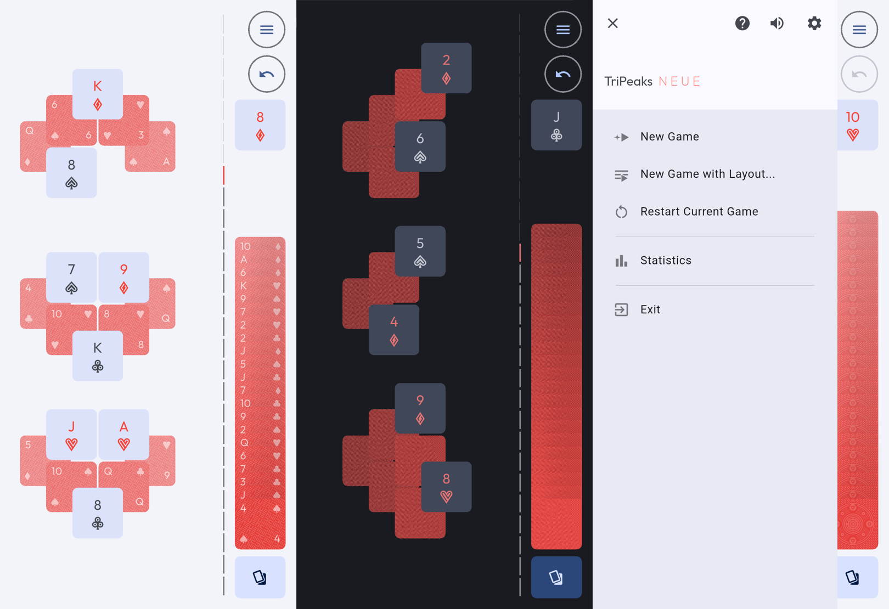
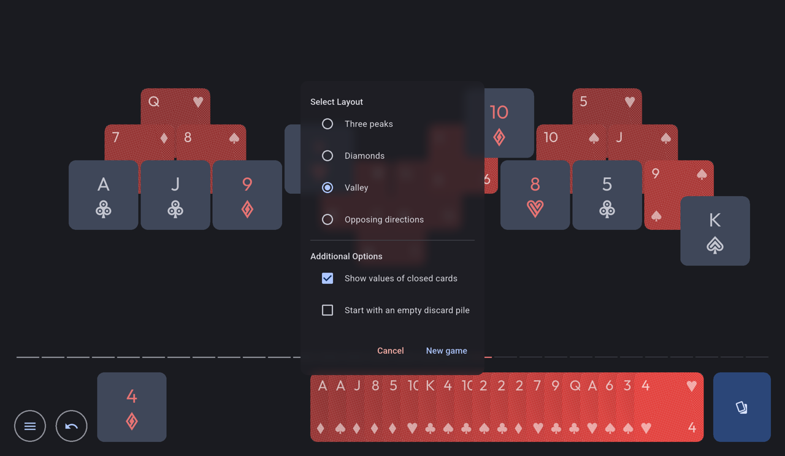

# TriPeaks NEUE

A simple [TriPeaks game](https://en.wikipedia.org/wiki/Tri_Peaks_(game)), using Flutter. This is a remake of [my previous implementation](https://github.com/mimoguz/tripeaks-gdx) of the same game.

## Main Features

- Four board layouts
- An option to show the values of face-down cards
- An option to start with an empty discard pile, allowing the player to choose any starting card
- Aggregated and per-layout statistics
- Portrait and landscape orientation support

## Screenshots

# License

This software is available under GNU Affero General Public License (AGPL) Version 3, except:

- _fonts/actions.ttf:_ This file includes symbols derived from Material Icons, and therefore available under Apache License Version 2.0 (same as Material Icons).
- _fonts/Outfit-VariableFont_wght.ttf:_ [Outfit Fonts](https://github.com/Outfitio/Outfit-Fonts) were designed by Smartsheet Inc, Rodrigo Fuenzalida, and available under SIL Open Font License (OFL) Version 1.1.