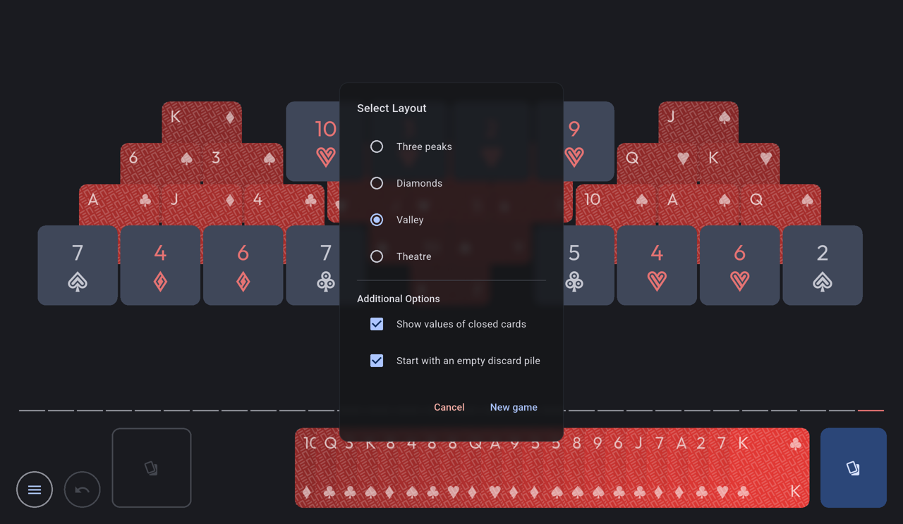

# TriPeaks NEUE

A simple [TriPeaks game](https://en.wikipedia.org/wiki/Tri_Peaks_(game)), using Flutter. This is a remake of [my previous implementation](https://github.com/mimoguz/tripeaks-gdx) of the same game.<br><br>

<div align="center">
<a href="https://buymeacoffee.com/mimoguz"></a>

<a href="https://f-droid.org/en/packages/io.github.mimoguz.tripeaksneue/"></a>
</div>

## Main Features

- Four board layouts
- An option to show the values of face-down cards
- An option to start with an empty discard pile, allowing the player to choose any starting card
- Aggregated and per-layout statistics
- Portrait and landscape orientation support

## Screenshots



## Credit where credit is due

While it's not a copy, I hope, the game draws a lot of design inspiration from Dustland Design's Solitaire - The Clean One. Credit where credit is due.

## License

This software is available under GNU Affero General Public License (AGPL) Version 3, except:

- _fonts/actions.ttf:_ This file includes symbols derived from Material Icons, and therefore available under Apache License Version 2.0 (same as Material Icons).
- _fonts/Outfit-VariableFont_wght.ttf:_ [Outfit Fonts](https://github.com/Outfitio/Outfit-Fonts) were designed by Smartsheet Inc, Rodrigo Fuenzalida, and available under SIL Open Font License (OFL) Version 1.1.

## DYNAMIC_RECEIVER_NOT_EXPORTED_PERMISSION issue

If you check the required permissions for this game on F-Droid, you will see that it requires ```DYNAMIC_RECEIVER_NOT_EXPORTED_PERMISSION```.

The best explanation I could find about this was again in the F-Droid repository:

* A closed merge request: [Don't catalog androidx DYNAMIC_RECEIVER_NOT_EXPORTED_PERMISSION hack](https://gitlab.com/fdroid/fdroidserver/-/merge_requests/1336) 
* An open issue: [handle androidx DYNAMIC_RECEIVER_NOT_EXPORTED_PERMISSION hack](https://gitlab.com/fdroid/fdroidclient/-/issues/2608)

**Tl;dr**: As far as I could understand, it's a compatibility hack rather than a true permission. Its existence means that the application uses broadcasts, but only internally and rejects intents coming from outside.
